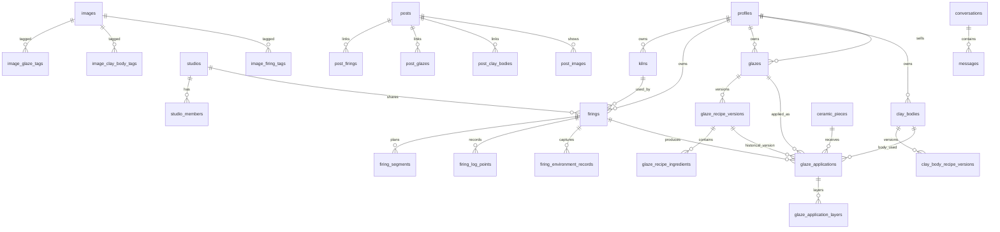

# Database Relationship Map

Key integrity rules:

- One glaze profile can have many recipe versions.
- A firing-specific glaze application references the exact glaze recipe version used.
- Clay bodies are canonical records, not text labels.
- Images are canonical storage metadata and use join tables for structured tags.
- Posts link to canonical records and may store only lightweight historical preview snapshots.
- Private recipe and firing data is filtered by RLS, not hidden only in the browser.
- Marketplace listings attach to glaze profiles so seller context, result history, recipe privacy, and safety disclosures remain connected.
